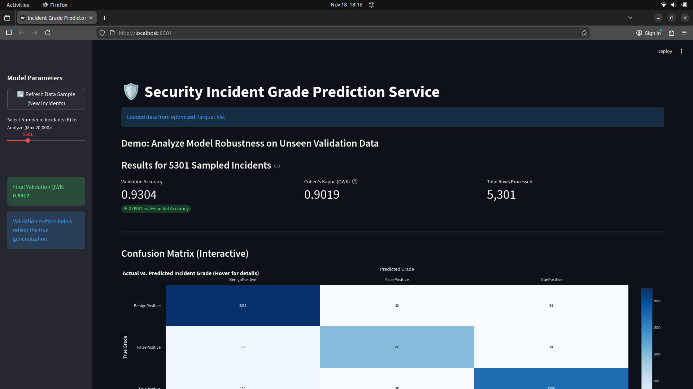
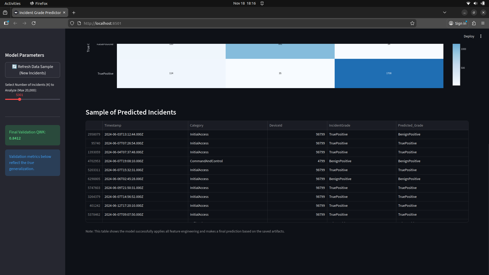

# 🛡️ Incident Grade Prediction Pipeline  
A complete end-to-end machine learning project for **Security Incident Grade Classification** using:

- **EDA** (Exploratory Data Analysis)
- **Feature Engineering** (Frequency Encoding + OHE + Time Features)
- **Model Training** (GPU-accelerated XGBoost)
- **Streamlit Web App** for evaluations & interactive predictions  
- **Reusable ML artifacts** stored via Joblib

<div align="center">
  
</div>
<div align="center">
  
</div

All major work is contained in a single notebook:  
📘 **`model.ipynb`**

---

## 📊 1. Project Overview  

This project predicts incident-grade labels for security alert logs:

- `FalsePositive`
- `BenignPositive`
- `TruePositive`

Using the official GUIDE dataset from Kaggle.

🎯 **Final Model Performance on Validation Data**:

| Metric | Score |
|-------|-------|
| **Accuracy** | **0.8717** |
| **Quadratic Kappa (QWK)** | **0.8412** |
| **Best Iteration** | 334 trees |

Confusion Matrix:

```
[[1665510   46899   40531]
 [ 146358  622431  133909]
 [ 133533   30874 1327947]]
```

---

## 📂 2. Repository Structure  

```
├── data/
│   ├── data_link.txt        # Kaggle link for dataset download
│   ├── GUIDE_Train.csv      # (Place after download)
│   ├── GUIDE_Test.csv       # (Place after download)
│
├── joblibs/                 # Saved ML artifacts
│   ├── frequency_maps.joblib
│   ├── target_label_encoder.joblib
│   ├── training_columns.joblib
│   ├── xgboost_incident_grade_model.joblib
│
├── app.py                   # Streamlit App for prediction & demo
├── model.ipynb              # Main notebook → EDA + Feature Engineering + Training Pipeline
├── README.md                # (this file)
```

---

## 📥 3. Download Dataset from Kaggle  

Inside:

```
./data/data_link.txt
```

You will find the Kaggle URL for the full dataset.

### **Steps:**

1. Open the link in `data_link.txt`
2. Download:
   - `GUIDE_Train.csv`
   - `GUIDE_Test.csv`
3. Place both inside:

```
./data/
```

---

## ⚙️ 4. Setup & Installation  

No virtual environment is required, but recommended.

### Install Python (3.9+)
Check your version:

```bash
python --version
```

---

## 📦 5. Install Required Libraries  

Run:

```bash
pip install pandas numpy plotly scikit-learn joblib xgboost streamlit matplotlib seaborn fastparquet pyarrow
```

### GPU Acceleration  
If CUDA is installed, XGBoost automatically uses:

```
device='cuda'
```

Otherwise it falls back to CPU.

---

## ▶️ 6. Running the Notebook (`model.ipynb`)  

Open JupyterLab or VSCode and run:

```bash
jupyter notebook model.ipynb
```

Inside the notebook you will find:

### ✔ Full EDA  
- Target distribution  
- Missing value analysis  
- Cardinality reports  
- Visualizations (Pie chart, Null bars, etc.)

### ✔ Feature Engineering  
- Timestamp → Hour, DayOfWeek, Month  
- IsBusinessHours  
- Frequency Encoding (train-based maps saved to joblibs/)  
- One-Hot Encoding  
- Column alignment  

### ✔ Model Training  
- XGBoost (multi:softprob) with early stopping  
- Evaluation on clean validation  
- Saving artifacts to `joblibs/`

### ✔ Exported Artifacts  
Your notebook saves:

```
frequency_maps.joblib
target_label_encoder.joblib
training_columns.joblib
xgboost_incident_grade_model.joblib
```

---

## 🌐 7. Run the Streamlit Demo App  

Your `app.py` loads:

- The trained XGBoost model
- All joblib artifacts
- Validation dataset
- Feature pipeline  
- Produces predictions + metrics + interactive confusion matrix

### Launch:

```bash
streamlit run app.py
```

Then open:

```
http://localhost:8501
```

---

## 🧠 8. Feature Engineering Summary  

### Temporal Features  
| Feature | Description |
|---------|-------------|
| Hour | 0–23 |
| DayOfWeek | 0–6 |
| Month | 1–12 |
| IsBusinessHours | 1 if 8AM–6PM |

### Frequency Encoding  
Applied to all high-cardinality categorical columns.

### One-Hot Encoding  
Applied to:

```
Hour  
DayOfWeek  
Month  
IsBusinessHours  
Category  
OSFamily  
OSVersion  
EntityType  
EvidenceRole
```

### Label Encoding  
```
FalsePositive → 0  
BenignPositive → 1  
TruePositive  → 2
```

---

## 🧪 9. Model Details  

```python
xgb.XGBClassifier(
    objective='multi:softprob',
    num_class=3,
    n_estimators=500,
    device='cuda',
    random_state=42,
    eval_metric='mlogloss',
    early_stopping_rounds=50
)
```

Best iteration: **334**

---

## 🚀 10. Workflow  

1. Download Kaggle data  
2. Run `model.ipynb`  
3. Verify joblibs are created  
4. Launch Streamlit app  
5. Interactively inspect predictions  

